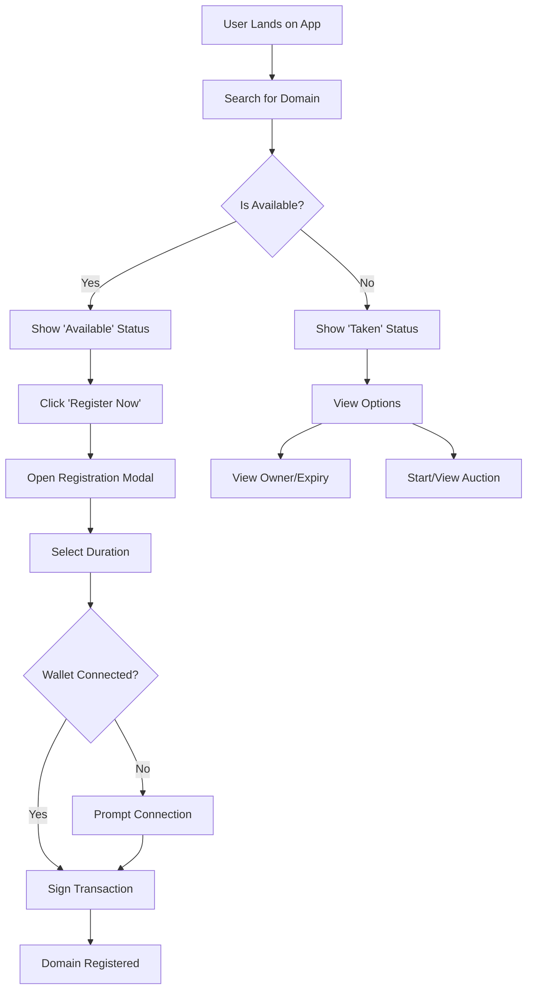
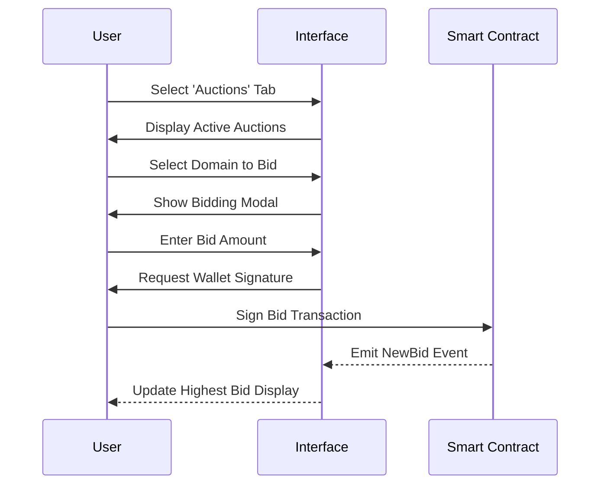
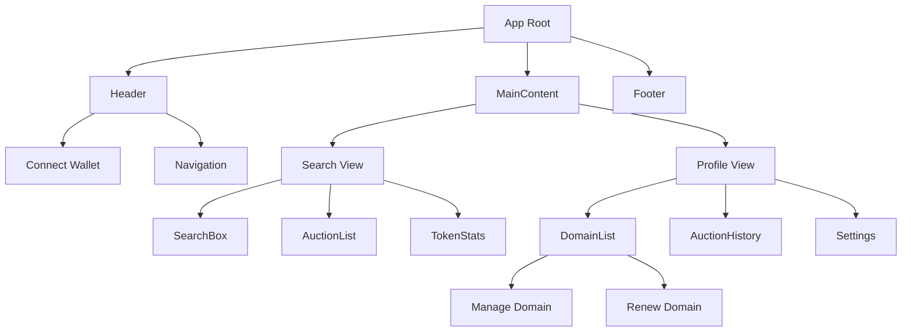

# Product Requirements Document (PRD) - Brother ID

## 1. Executive Summary
**Brother ID** is a decentralized identity provider built on the **Starknet** blockchain. It aims to provide user-friendly, verifiable, and tradable identities with the **.real** top-level domain extension. Similar to ENS (Ethereum Name Service), Brother ID allows users to map human-readable names to complex blockchain addresses, while incorporating auction mechanics and a premium user experience.

## 2. Project Scope
The project encompasses a frontend web application for:
- Searching and discovering domains.
- Registering new identities.
- Managing owned domains.
- Buying/Selling domains via auctions.
- Viewing token statistics.

## 3. Technology Stack
- **Frontend Framework**: React (Vite)
- **Language**: TypeScript
- **Styling**: Tailwind CSS (with custom animations and gradients)
- **Blockchain Interaction**: starknet.js v10 Wallet Standard discovery and `WalletAccountV6`
- **Privacy**: STRK20 Wallet API v0.10.3+ (`strk20Balances`, `strk20PrepareInvoke`, and `strk20InvokeTransaction`)
- **State Management**: React Hooks (local state)

## 4. Key Features & Functional Requirements

### 4.1. Domain Search & Discovery
- **Search Bar**: Users can input keywords to search for domains.
- **Availability Check**: Real-time check if a domain is available or taken (simulated via `useBns` hook currently).
- **Suggestions**: Auto-suggest variations (e.g., adding suffixes like "id", "stark") and popular keywords.
- **Status Display**: 
  - **Available**: Shows green indicator, "Register Now" button.
  - **Taken**: Shows red indicator, owner address, expiry date, "Manage", and "Auction" options.

### 4.2. Identity Registration
- **Registration Modal**: Flow to register an available domain.
- **Duration Selection**: Users typically select registration years (implied in UI "Select years in modal").
- **Payment**: Integration with Starknet wallet for transaction signing.

### 4.3. Auctions & Marketplace
- **Auction Listing**: Users can start auctions for domains they own using `StartAuctionModal`.
- **Bidding**: Users can place bids on active auctions (`BiddingModal`).
- **Auction History**: View historical auction data for transparency.
- **Active Auctions**: Dedicated tab to explore currently running auctions.

### 4.4. User Profile & Management
- **Wallet Connection**: Connect via Argent X / Braavos (Starknet wallets).
- **Dashboard**:
  - View Wallet Address and User Icon.
  - **My Domains**: List of owned `.real` domains.
  - **Manage Domains**: Edit records, renew domains (`RenewalModal`, `ManageDomainModal`).
  - **Settings**: User preferences.
- **Auction History**: Personal history of bids and sales.

### 4.5. Token Statistics
- **Stats Tab**: Graphical representation of token data (referenced as `TokenChart`).

## 5. User Interface And Experience
- **Theme**: Dark mode, Cyberpunk/Futuristic aesthetic.
- **Color Palette**: 
  - Backgrounds: Dark Gray/Black (`#0D1117`, `#161B22`)
  - Accents: Neon Blue (`#00c6ff`), Green (`#00f2a1`), Pink/Rose (for specific tags).
- **Animations**: Fade-ins, hover scaling effects, backdrop blur for modals.
- **Responsive Design**: Fully responsive for Mobile, Tablet, and Desktop.

## 6. System Workflows (Visualized)

### 6.1 User Journey: Search & Register

### 6.2 User Journey: Auction Bidding

### 6.3 Site Architecture

## 7. Assumptions & Constraints
- The project currently relies on mocked data in some places (like `mockSuggestions` in SearchBox) or specific hooks (`useBns`) that need to be fully integrated with live Starknet contracts.
- "Real" domain extension is the primary product.
- Private STRK supports Starknet Mainnet and Sepolia through wallets exposing STRK20 Wallet API v0.10.3 or newer. Privacy keys and proofs stay inside that wallet. `.real` registration and resolution remain a clearly labeled Sepolia beta.

## 8. Future Roadmap
- Full Smart Contract integration for Registry, Resolver, and Auction Controller.
- Secondary marketplace features.
- Expanded record management (socials, avatars).
